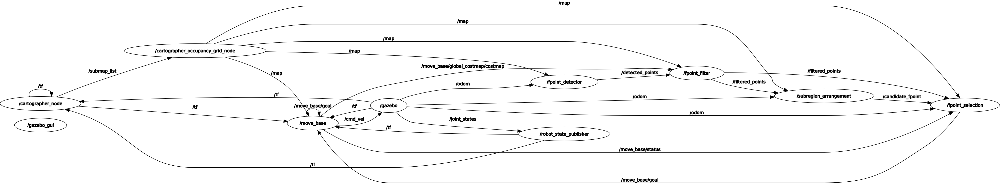

# TDLE

[The corresponding paper ***[TDLE: 2D Lidar Exploration with Hierarchical Planning Using Regional Division](https://arxiv.org/pdf/2307.02852.pdf)*** has been accepted by IEEE CASE 2023.]

## Introduction

Demonstration Video:

### Frontier Detection
The frontier detection module is adapted from Hasauino's [rrt_exploration](https://github.com/hasauino/rrt_exploration) (sincere thanks for his work), with series of improvements, including:

  - Set sampling boundary automatically;

  - Dynamically adjust the number of nodes in the global tree.

The entire code has been refactored for clearer logic and efficient implementation as well.

### Hierarchical Planning

The hierarchical exploration planning module is the core component of this framework. 

In the first phase, the planning space is divided into several subregions. After that, subregions with frontier points inside or mostly unknown are selected. The selected subregions are then sorted to provide global guidance for exploration. 

In the second phase, the subregions are visited one by one in the order determined in the first phase. In each subregion, various indicators, including global compatibility, information gain, and motion consistency, are calculated. Robot selects the exploration target with the highest comprehensive revenue.

## Quick Start

### Prerequisites

  We tried to minimize the unnecessary use of third-party libraries (like OpenCV, tf, etc). Simple external functions were implemented manually.

  - **Basic ROS Environment**
      
      Make sure you have ROS environment properly installed. This project has been tested on several devices under [ROS-Melodic](http://wiki.ros.org/melodic/Installation/Ubuntu) and [ROS-Noetic](http://wiki.ros.org/noetic/Installation/Ubuntu). (`Desktop-Full` version is recommend)
  
  - **Local Planner**

      Currently, TDLE uses `TEB` as its local planner by default. Install it with:

          sudo apt install ros-noetic-navigation
          sudo apt install ros-noetic-teb-local-planner

      At the same time, `DWA`, which is already included in `ros-noetic-navigation`, can also be used as the local planner. You can change the `planner_name` parameter in `tdle_sim.launch`.

  - **Cartographer_ROS**
    
    TDLE use cartographer as its mapping module, with a few adaptions that make it suitable for exploration. Using [this fork](https://github.com/SeanZsya/cartographer_ros) instead of original repository. 
    
    In fact, TDLE supports any method that can generate an occupancy grid map with message type `nav_msgs/OccupancyGrid`.

  - **Gazebo Models** (optional)

    The model files required by `robot(turtlebot3-waffle)` and `museum simulation scene `have been placed in folder `sim_models`, no need for additional downloads.

    If you want to use the `library simulation scene`, please download [extra models](https://github.com/aws-robotics/aws-robomaker-bookstore-world/tree/ros1/models), put them in your Gazebo model folder (usually `~/.gazebo/models`), and change the `world_name` parameter in `tdle_sim.launch`.

    
### Run TDLE

  - **For Gazebo Simulation**
    
        roslaunch tdle tdle_sim.launch

  - **For Field Test**
        
        roslaunch tdle tdle_real.launch
        
     <!-- Note: If you use SSH to establish a connection with the robot, RViz will not open on the operation interface. You need to use remote desktop or setup master/slave communication in ROS for visualization. -->

## Known Issues
